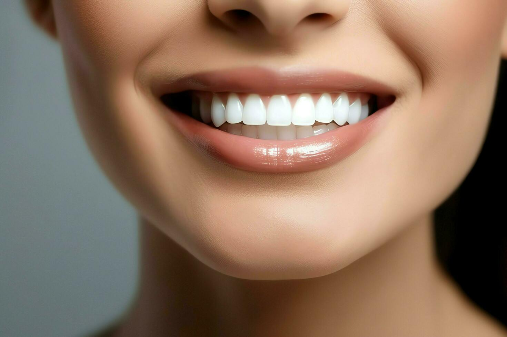

# Dental Image Classifier

This repository contains a dental image classification application built with TensorFlow 2.19.0 and Streamlit. The model is trained to classify dental images into seven categories using a convolutional neural network (CNN). The trained model is saved as a `.pkl` file using `pickle` to simplify loading and avoid serialization issues with TensorFlow's HDF5 format.

## Overview

- **Model**: A CNN architecture with Conv2D, BatchNormalization, MaxPool2D, Dense, and Dropout layers.
- **Dataset**: Dental images from `/kaggle/input/teeth/Training/` and `/kaggle/input/teeth/Validation/`, resized to 150x150 pixels.
- **Output Format**: The model is saved as `teeth_classification_model.pkl`, including the model and class names.
- **Interface**: A Streamlit web app for uploading and classifying single or multiple dental images.

## 🖼️ **Banner**


## Prerequisites

- **Python 3.9+**
- **Required Libraries**:
  - `tensorflow==2.19.0`
  - `numpy`
  - `pillow`
  - `matplotlib`
  - `streamlit`
  - `pickle` (included in Python standard library)

## Setup Instructions

### 1. Clone or Download the Repository
- Download the files (`train.py`, `app.py`, and this README) or clone the repository if hosted.

### 2. Install Dependencies
Open a command prompt or terminal and run:
```bash
pip install tensorflow==2.19.0 numpy pillow matplotlib streamlit
```
- Ensure `pip` is up to date by running:
  ```bash
  python.exe -m pip install --upgrade pip
  ```
- Verify TensorFlow version:
  ```bash
  python -c "import tensorflow as tf; print(tf.__version__)"
  ```
  It should output `2.19.0`.

### 3. Prepare the Dataset
- Place your dental image dataset in the following structure:
  ```
  /kaggle/input/teeth/
  ├── Training/
  │   ├── Class_0/
  │   ├── Class_1/
  │   ├── ...
  │   └── Class_6/
  └── Validation/
      ├── Class_0/
      ├── Class_1/
      ├── ...
      └── Class_6/
  ```
- Ensure images are compatible (e.g., JPG, JPEG, PNG) and can be resized to 150x150 pixels.

### 4. Train the Model
- Save the provided code into a file named `train.py`.
- Run the training script:
  ```bash
  python train.py
  ```
- This will:
  - Train the CNN on the dataset.
  - Display class distribution and augmentation examples.
  - Save the model as `teeth_classification_model.pkl` in the current directory.
- Move the generated `teeth_classification_model.pkl` to `C:\Users\asus\Downloads\teeth classfication\`.

## Usage

### 1. Run the Streamlit App
- Save the provided code into a file named `app.py`.
- Navigate to the directory containing `app.py` in a command prompt or terminal.
- Start the app:
  ```bash
  streamlit run app.py
  ```
- Open your browser and go to `http://localhost:8501`.

### 2. Classify Images
- **Single Image Prediction**:
  - Use the "Single Image Prediction" section to upload one dental image (JPG, JPEG, or PNG).
  - The app will display the predicted class, confidence score, and class probabilities.
- **Test Multiple Images**:
  - Use the "Test Multiple Images" section to upload multiple images.
  - The app will process each image and show the predictions individually.

## Files

- `train.py`: Script to train the CNN and save the model as `.pkl`.
- `app.py`: Streamlit application for image classification.
- `README.md`: This file, providing setup and usage instructions.

## Troubleshooting

- **Model Not Found**: Ensure `teeth_classification_model.pkl` is in `C:\Users\asus\Downloads\teeth classfication\`. Recheck the file path in `app.py` if needed.
- **Loading Errors**: If you encounter errors loading the model, verify TensorFlow 2.19.0 is installed and resave the model by rerunning `train.py`. Check for Python version compatibility (3.9+).
- **Prediction Issues**: Ensure uploaded images match the training data (150x150 pixels, dental images). Adjust `class_names` in `app.py` if the class labels differ.
- **Performance**: Training may be slower without `mixed_float16`, but this ensures compatibility. Report any errors for further assistance.

## Notes
- The model uses data augmentation (flips, rotations, brightness, contrast) to improve robustness.
- Class names are saved with the model in the `.pkl` file, so no manual updates are needed unless the dataset changes.
- For additional support, share any error messages or training output.
